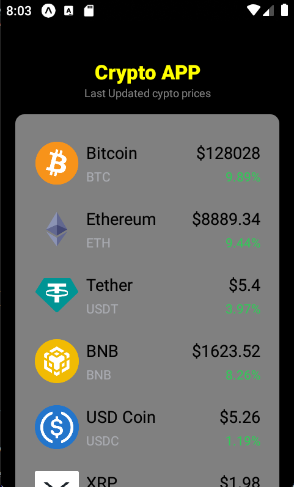

# Site Velozes e furiosos


<p align="center" width="100%">
    
    
    
</p>

> A aplicação, criada com o objetivo de práticar melhor a utilização de APIs, que consiste em aplicativo que monitore o atual valor das crypto moedas em tempo real.

### Roadmap

- [x] Criar HomePage
- [x] Estilizar Homepage
- [x] Comunicação com API


## 💻 Pré-requisitos

Antes de começar, verifique se você atendeu aos seguintes requisitos:

* Você instalou a versão mais recente de `<React Native / npm / Expo>`
* Você tem uma máquina `<Windows / Linux / Mac>`.


## ☕ Usando <Site-velozes-e-furiosos>

Para usar <Site-velozes-e-furiosos>, siga estas etapas:

```
<git clone https://github.com/iamjvictor/CryptoApp.git
```
```
<npm start>
```


## 📫 Contribuindo para <Site-velozes-e-furiosos>

Para contribuir com <CryptoAPP>, siga estas etapas:

1. Bifurque este repositório.
2. Crie um branch: `git checkout -b <nome_branch>`.
3. Faça suas alterações e confirme-as: `git commit -m '<mensagem_commit>'`
4. Envie para o branch original: `git push origin <CryptoAPP>`
5. Crie a solicitação de pull.

Como alternativa, consulte a documentação do GitHub em [como criar uma solicitação pull](https://help.github.com/en/github/collaborating-with-issues-and-pull-requests/creating-a-pull-request).


## 📝 Licença

Esse projeto está sob licença. Veja o arquivo [LICENÇA](LICENSE.md) para mais detalhes.

[⬆ Voltar ao topo](#CryptoAPP)<br>